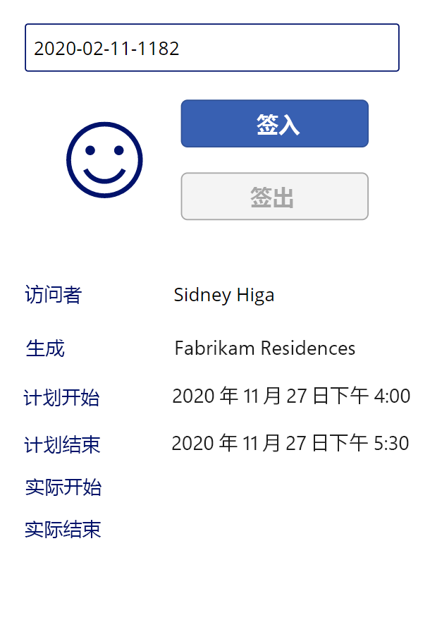

---
lab:
    title: '实验室 3：如何生成画布应用，第 2 部分'
    module: '模块 3： Power Apps 入门'
---

# 模块 3： Power Apps 入门
## 实验室 2：如何生成画布应用，第 2 部分

# 应用场景

贝洛斯学院 (Bellows College) 是一所教育机构，校园内有多座建筑。目前，校园访问记录在纸质日报上。无法始终如一地捕获信息，也无法收集和分析有关整个校园的访问数据。 

校园管理部门希望对其访客登记系统进行现代化改造。在该系统中，由安全人员控制对建筑物的访问，所有访问都必须由主办人预先登记和记录。

在整个课程中，你将生成应用程序并执行自动化，以使 Bellows College 的管理和安全人员可以管理和控制校园建筑的出入情况。 

在本实验室的第 2 部分，你将创建设计并生成一个 Power Apps 画布应用，安全人员将在建筑入口使用该应用来快速确认和登记访问者。

# 概要实验室步骤

将按照以下大纲设计画布应用：

-   使用手机外形规格创建应用
-   连接到 Common Data Service，将其作为数据源
-   捕获输入（访问者代码）并找到访问者记录
-   配置表单查看器控件以显示访问者信息
-   使用 Common Data Service 视图填充库
-   处理访问者的签入和签出流程

## 前提条件

* 完成**模块 0 实验 0 - 验证实验室环境**
* 完成**模块 2 实验 1 - Common Data Service 简介**

## 开始前要考虑的事项

-   安全管理人员需要快速访问哪些信息？
-   如果访问者代码无效该怎么办
-   如果访问者在计划时间以外到该怎么办 

# 练习 \#1：创建安全画布应用

**目标：** 在本练习中，你将创建一个画布应用。

## 任务 \#1：创建画布应用

1.  打开校园管理解决方案。

    -   登录至 <https://make.powerapps.com>

    -   如果右上角显示的环境不是你的练习环境，请选择你的**环境**。 

    -   选择 **“解决方案”**。

    -   单击打开 **“校园管理”** 解决方案。
    
2.  新建画布应用程序

    -   单击 **“新建”**，然后选择 **“应用 \| 画布应用 \| 手机外形规格”**。
        这将在新窗口中打开应用编辑器。
        
    -   如果出现“欢迎使用 Power Apps Studio”对话框，单击 **“跳过”**。
    
3.  保存画布应用

    -   单击 **“文件”**，然后选择 **“另存为”**。
    
    -   检查是否选择了 **“云”**。 
    
    -   输入 **“你的姓氏 校园安全”** 作为“名称”，然后单击 **“保存”**。
        
    -   单击左上角的 **“后退”** 箭头（在 Power Apps 下方）返回到该应用。

3.  连接到数据源（访问）

    -   单击 **“查看 \| 数据源**
    
    -   单击 **“查看所有实体”** 
    
    -   选择 **“访问”**，并等待“访问”实体显示在 **“你的应用数据”** 部分。
    
4.  要保留正在进行的工作，请单击 **“文件”**，然后单击 **“保存”**。使用后退箭头返回到应用。

## 任务 \#2：显示访问者信息

1.  添加搜索框

    -   选择左侧导航栏上的 **“树视图”** 选项卡。
    
    -   选择 **“Screen1”**。
    
    -   前往 **“插入”** 选项卡。
    
    -   单击 **“文本”**，然后选择 **“文本输入”**。
    
2.  编辑文本输入对象

    -   在仍然选中“文本”输入对象的同时，选择 **“默认”** 属性中的文本并清除该值。
    
    -   选择 **“HintText”** 属性，并输入 `"Enter visitor code"` 作为值（包括英文双引号）
    
    -   单击树视图中控件名称 (TextInput1) 旁边的  **...**，然后选择 **“重命名”**，将名称更改为 `textCode`
    
3.  添加表单视图

    -   在 **“插入”** 选项卡上，单击 **“表单”**，然后选择 **“显示”**
   
    -   使用大小句柄，将窗体放置在搜索文本框下方
   
    -   选择 **“DataSource”** 属性并选择 **“访问”**
   
    -   在“属性”窗格中，选择 **“水平”** 作为 **“布局”**

4.  编辑表单视图

    -   单击 **“编辑字段”**
   
    -   单击 **“添加字段”** 并选择以下字段：**“实际结束时间”**、 **“实际开始时间”**、 **“建筑”**、 **“计划结束时间”**、 **“计划开始时间”**、 **“访问者”**
   
    -   按 **“添加”**
   
    -   删除 **“名称”** 和 **“创建日期”** 字段
   
    -   通过拖动列表中的字段卡来更改所选字段的顺序。推荐的顺序是：访问者、建筑物、计划开始时间、计划结束时间、实际开始时间、实际结束时间
   
    -   单击 **“X”** 关闭“字段”窗格
   
5.  在仍选择窗体视图的同时，选择“属性”窗格的“高级”选项卡。选择 **“项目”** 属性，然后输入 `LookUp(Visits, Code = textCode.Text)` 

6.  要保留正在进行的工作，请单击 **“文件”**，然后单击 **“保存”**。使用后退箭头返回到应用。

7.  准备测试应用

    -   切换到包含解决方案的浏览器选项卡
   
    -   选择 **“访问”** 实体
   
    -   选择 **“数据”** 选项卡
   
    -   单击当前的视图名称 **“有效访问”**，打开右上角的视图选择器
   
    -   将视图更改为 **“所有字段”**
   
    -   找到一个没有“实际开始时间”值或“实际结束时间”值的访问记录。选择并复制该访问的 **“代码”**。

8.  测试应用

    -   切换到应用的浏览器选项卡，按 **F5** 或单击右上角的**播放**图标，来预览应用。
   
    -   将复制的值粘贴到搜索文本框，验证记录是否显示在表单中
   
9.  清除搜索文本框的内容。
   
10.  按 **ESC** 退出正在运行的应用。

## 任务 \#3：添加签入和签出按钮

在此任务中，我们将创建用户用于签入和签出访问的按钮。 

1. 将搜索结果保存到变量中以在整个控件中重复使用

    * 选择 **“textCode”** 控件
   
    * 在属性窗格中，选择 **“高级”** 选项卡并选择 **“OnChange”** 属性
   
    * 输入以下表达式 `Set(Visit, LookUp(Visits, Code = textCode.Text))`
    
    > 当用户在 textCode 搜索框中搜索时，这会将访问保存在全局变量中。这使我们可以在整个应用中使用变量 *Visit*，而无需重新输入整个查找表达式。

2. 添加“签入”按钮

   * 选择 **“插入”** 选项卡
   
   * 单击 **“按钮”**
   
   * 在属性窗格中，将按钮 **“文本”** 属性更改为“`Check In`”（你可以在现有引号中输入）
   
   * 单击树视图中按钮名称 (Button1) 旁边的 **“...”**，选择 **“重命名”**，将名称更改为 `CheckInButton`

3. 添加“签出”按钮   

   * 在“插入”选项卡上单击 **“按钮”**，插入另一个按钮
   
   * 在属性窗格中，将按钮 **“文本”** 属性更改为“`Check Out`”（你可以在现有引号内输入）
   
   * 将按钮重命名为 `CheckOutButton`
   
   * 将这些按钮放置在搜索框下方，其中 **“签入”** 位于 **“签出”** 上方 
   
## 任务 \#4：根据访问数据启用和禁用按钮

如果已找到访问记录（非空）、记录状态为活动且访问尚未开始（即实际开始值为空），那么我们会启用 **“签入”** 按钮。

1. 选择 **“签入”** 按钮，然后在“属性”选项卡中单击按钮的 **“DisplayMode”** 属性

2. 在函数栏中输入以下表达式：

      ```
      If(!IsBlank(Visit) 
      && Visit.Status = 'Status (Visits)'.Active
      && IsBlank(Visit.'Actual Start'),
          DisplayMode.Edit,
          DisplayMode.Disabled
      )
      ```

   该表达式可以按如下方式分解：

   * **IsBlank(Visit)** - 访问记录已找到
   * **&&** - 逻辑 AND 运算符
   * **Visit.Status = 'Status (Visits) '.Active** 记录状态为 *“活动”*
   * **IsBlank (Visit.'Actual Start')** - 活动开始字段中没有任何数据
   * **DisplayMode.Edit, DisplayMode.Disabled** - 如果满足以上条件，按钮将变为可编辑状态。否则，按钮将保持禁用状态。

如果已找到访问记录（非空）、记录状态为活动且访问已经开始（即实际开始值为非空），那么我们会启用 **“签出”** 按钮。

3. 选择“签出”按钮，然后在“属性”选项卡中单击按钮的 **“DisplayMode”** 属性

4. 在函数栏中输入以下表达式：

     ```
     If(!IsBlank(Visit) 
     && Visit.Status = 'Status (Visits)'.Active
     && !IsBlank(Visit.'Actual Start'),
         DisplayMode.Edit,
         DisplayMode.Disabled
     )
     ```

5. 要保留正在进行的工作，请单击 **“文件”**，然后单击 **“保存”**。使用后退箭头返回到应用。

6. 按 **F5**，运行应用。 

7. 两个按钮均应禁用。输入你先前复制的代码值，然后按  **Tab** 键，将焦点从文本框移开。 **“签入”** 按钮应变为启动状态。 

8. 清除搜索框的内容。

9. 按  **ESC** 退出正在运行的应用。

## 任务 \#5：完成签入和签出流程

要执行签入和签出流程，我们需要更新 Common Data Service 访问数据，如下所示：

* 访问者签到时，将*实际开始时间*字段设置为当前日期和时间
* 访问者签出时，将*实际结束时间*字段设置为当前日期和时间。 
* 签出后，将记录状态设置为“非活动”，表明访问已完成

1. 选择 **“签入”** 按钮。

2. 将“高级”选项卡上的 **“OnSelect”** 属性设置为以下表达式。

   ```
   Patch(
       Visits,
       Visit,
       {'Actual Start': Now()}
   );
   Refresh([@Visits]);
   Set(Visit, LookUp(Visits, Code = textCode.Text));
   ```

   此表达式包含以下部分：

   * **Patch(Visits, Visit, {'Actual Start': Now()});**. *Patch* 方法更新 **Visits** 实体，它是由 **Visit** 变量（当前访问）标识的记录。该表达式将 *“实际开始”* 字段的值设置为当前日期和时间 (*Now()* 方法）。
   * **Refresh([@Visits]);**. 此表达式在基础值发生更改时刷新访问记录
   * **Set(Visit, LookUp(Visits, Code = textCode.Text));** 此表达式使用来自 Common Data Service 的新数据更新 *Visit* 变量。
   
   > 当用户单击此按钮时，“实际访问开始时间”将设置为当前日期和时间，并且数据将刷新。

3. 选择 **“签出”** 按钮。

4. 将“高级”选项卡上的 **“OnSelect”** 属性设置为以下表达式：

   ```
   Patch(
       [@Visits],
       Visit,
       {
           'Actual End': Now(),
           Status: 'Status (Visits)'.Inactive
       }
   );
   Refresh([@Visits]);
   Set(Visit, LookUp(Visits, Code = textCode.Text));
   ```

   当用户单击此按钮时，“实际结束时间”将设置为当前日期和时间，“访问的状态”记录将设置为“非活动”，并且数据将刷新。

5. 要保留正在进行的工作，请单击 **“文件”**，然后单击 **“保存”**。使用 **“后退”** 箭头返回到应用。

6. 按 **F5** 或单击“执行”按钮以运行该应用。输入你先前复制的代码值，然后按 **Tab** 键，将焦点从文本框移开。 **“签入”** 按钮应变为启动状态。

7. 按 **“签入”** 按钮。应该发生以下情况：

   * **“实际开始时间”** 设置为当前日期和时间
   
   * **“签入”** 按钮被禁用
   
   * **“签出”** 按钮被启用

8. 按 **“签出”** 按钮。

   * **“实际结束时间”** 已设置成当前日期和时间
   
   * 两个按钮均被禁用

9. 清除搜索框的内容。

10. 按 **ESC** 退出正在运行的应用。

## 任务 \#6：添加视觉指示

如果提供视觉指示，移动应用的可用性会大大提高。在此任务中，我们将添加一个图标，指示是否可以签入或签出访客。

1. 选择 **“插入”** 选项卡

2. 选择 **“图标 \| “添加”**。此时，选择哪个图标无关紧要，因为我们希望该值是动态的。

3. 调整图标大小并将其放置在按钮左侧

4. 在“图标”的“高级”选项卡中，选择 **“图标”** 属性（在“设计”部分中），然后输入以下表达式

   ```
   If(
      CheckInButton.DisplayMode = DisplayMode.Disabled 
   && CheckOutButton.DisplayMode = DisplayMode.Disabled,
       Icon.EmojiFrown,
       Icon.EmojiSmile
   )
   ```

5. 要保留正在进行的工作，请单击 **“文件”**，然后单击 **“保存”**。使用 **“后退”** 箭头返回到应用。

6. 按 **F5**，运行应用。输入你先前复制的代码值，然后按 **Tab** 键，将焦点从文本框移开。验证图标显示皱眉的表情符号。

7. 查找之前未使用过的其他代码值（它不应具有“实际起始值”或“实际结束值”）。 

    > 可以导航到上一个选项卡，从已创建的访问中复制另一个代码。也可以运行之前创建的 **“Campus Staff”** 应用来新建访问记录。验证对于这个代码，图标是否显示为微笑表情符号。

正在运行的应用看上去大致如下图所示：



8. 按 **ESC** 退出正在运行的应用。

## 任务 #7：发布应用

1. 仍应在浏览器中打开 Campus Security 应用。如果不是，请选择 **“Campus Security”** 应用，单击 **“编辑”**。

2. 选择 **“文件 \| 发布** 

3. 选择 **“发布此版本”**

# 挑战

* 如何避免手动输入访问代码？
* 为访问添加建筑验证
* 添加访问实际时间与访问计划时间的验证（过早、过晚等）
* 添加访问详细状态，例如电子邮件显示和访问者验证、拒绝访问建筑的原因等
* 在单一校园访问中进行多个建筑物/会议/检查。例如，某人可能会访问校园一天，在这一天中将在不同时间会见多个建筑中的工作人员。你会考虑将*约会*实体加入解决方案吗？
