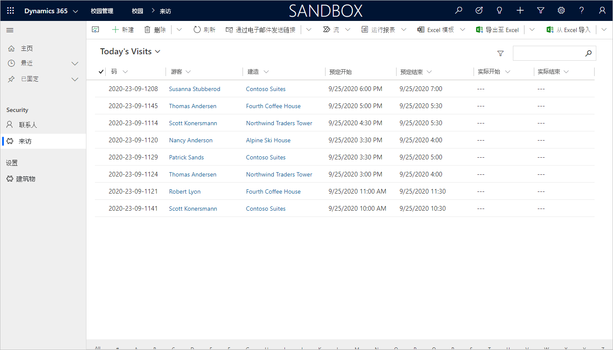

---
lab:
    title: '实验室 4：如何生成模型驱动应用'
    module: '模块 3： Power Apps 入门'
---

# 模块 3： Power Apps 入门
## 实验室 3：如何构建模型驱动的应用

应用场景
========

贝洛斯学院 (Bellows College) 是一所教育机构，校园内有多座建筑。当前，校园访客被记录在纸质日记中。无法始终如一地捕获信息，也无法收集和分析有关整个校园的访问数据。 

校园管理部门希望对其访客登记系统进行现代化改造。在该系统中，由安全人员控制对建筑物的访问，所有访问都必须由主办人预先登记和记录。

在整个课程中，你将生成应用程序并执行自动化，以使 Bellows College 的管理和安全人员可以管理和控制校园建筑的出入情况。 

在本实验室中，你将生成一个 Power Apps 模型驱动应用，以允许后台办公室的校园工作人员管理整个校园的访问记录。

概要实验室步骤
======================

作为创建模型驱动应用的一部分，你将完成以下操作：

-   新建一个名为“校园管理”的模型驱动应用

-   编辑应用导航以引用所需的实体

-   自定义应用所需实体的表单和视图

我们将使用以下组件：

- **视图**：视图允许用户显示表单中的现有数据
表的。

- **Forms**：用户在此处创建/更新实体中的新记录。

两者都将集成到模型驱动应用中，以提供更好的用户体验。

## 先决条件

* 完成**模块 0 实验 0 - 验证实验室环境**
* 完成**模块 2 实验 1 - Common Data Service 简介**

开始前要考虑的事项
-----------------------------------

-   应该进行哪些更改以改善用户体验？

-   基于我们生成的数据模型，我们应该在模型驱动应用中包括哪些内容？
    
-   可以在模型驱动应用的站点地图上进行哪些自定义？

练习 1：自定义视图和窗体
=======================================

**目标：** 在本练习中，你将自定义将在模型驱动应用中使用的自定义创建实体的视图和窗体。

任务 \#1：编辑访问窗体
-----------------------------------

1.  如果尚未登录，请在 <https://make.powerapps.com> 登录。

2.  选择你的 **“环境”。**

3.  选择 **“解决方案”**。

4.  单击打开 **“校园管理”** 解决方案。

5.  单击打开 **“访问”** 实体。

6.  选择 **“窗体”** 选项卡，然后单击打开 **“主”** 窗体类型。 

    -   表单默认有两个字段：“名称”（主字段）和“所有者”。
    
7.  通过将字段拖动到表单中或直接单击字段名，在 **“所有者”** 字段下添加以下字段：

    * **生成**
    * **访问者**
    * **计划开始**
    * **计划结束**
    * **实际开始**
    * **实际结束** 
    
8.  拖动**代码**字段并放置在窗体标题处。（你可能需要最小化屏幕右侧的“属性”面板才能看到窗体上的字段。）

9.  在“代码”字段仍然选中时，在“属性”面板中选中 **“只读字段”** 复选框。

10.  选择 **“所有者”** 字段。在“属性”面板中将 **“字段标签”** 更改为 **“主机”**

11.  单击右上方的 **“保存”**，然后等待保存完成。

12.  单击右上方的 **“发布”**，并等待发布完成。

13.  单击屏幕左上方的 **“上一步”**。现在，你已经后退到
     访问实体“表单”选项卡。

## 任务 \#2：编辑访问视图

在此任务中，我们将修改默认的“活跃访问”视图并为今天的访问新建视图。

1.  选择 **“视图”** 选项卡，然后单击打开 **“可用访问”** 视图。

2.  通过单击或拖放字段，将以下字段添加到视图中：

    *  **代码**
    *  **访问者**
    *  **生成**
    *  **计划开始** 
    *  **计划结束**
    
3.  单击 **“创建时间”** 列并选择 **“删除”**。现在将从视图中删除 **“创建时间”** 字段。

4.  单击 **“名称”** 列并选择 **“删除”**。现在将从视图中删除 **“名称”** 字段。

5.  在右侧的“属性”面板中，单击 **“排序依据...”**，然后选择 **“计划开始时间”**。再次单击 **“计划开始时间”**，将排序方式更改为降序（新访问置顶）。

6.  调整各个列的宽度以适合数据。

7.  单击 **“保存”**，然后等待更改保存完毕。

8.  单击 **“发布”** 并等待发布完成。

9.  现在我们将克隆视图，来为今天的访问创建一个新视图。

10.  单击 **“保存”** 按钮旁的下拉箭头（请注意不是按按钮本身）并选择 **“另存为”**。

11.  将名称更改为 **“今天的访问”**，然后按 **“保存”**。

12.  按“属性”面板中的 **“编辑筛选器”** 链接。

13.  单击 **“添加”**，选择 **“添加行”**。

14.  选择 **“计划开始时间”** 作为字段，然后选择 **“今天”** 作为条件。 

15.  单击 **“状态”** 行上的 **“...”** 并单击 **“删除”**。 

16.  视图现已经过筛选，仅显示计划开始日期为今天的记录。按 **“确定”** 以保存该条件。

17.  在视图中添加 **“实际开始时间”** 和 **“实际结束时间”** 字段。 

        > **备注：** 由于我们不再筛选视图状态，因此我们将获得今天所有的访问，包括已完成的访问。这些字段有助于区分完成的访问和进行中的访问。

18.  单击 **“保存”**，然后等待更改保存完毕。

19.  单击 **“发布”** 并等待发布完成。

练习 \#2：创建模型驱动应用程序
=============================================

**目标：** 在本练习中，你将创建模型驱动应用、自定义站点地图并测试该应用。

> 在生成应用程序时，特别是在自定义站点地图步骤中，你会看到一些未解决的字段。为了进行实验室研究，我们采取了一些捷径。在具体实现时，应为这些项目指定逻辑名称。

任务 \#1：创建应用程序
----------------------------

1.  如果尚未打开“校园管理”解决方案，请打开该解决方案。

    -   登录至 <https://make.powerapps.com>

    -   在你的环境中，单击以打开 **“校园管理”**
        解决方案。
    
2.  创建模型驱动应用程序

    -   单击 **“新建”**，选择 **“应用”**，再选择 **“模型驱动应用”**。这将打开一个新选项卡。
    
    -   选择 **“使用现有解决方案创建应用”** 复选框
    
    -   在“名称”中输入 **“[你的姓氏]校园管理” ，然后单击“下一步”**。
    
    -   选择“校园管理”解决方案
    
    -   单击 **“完成”**
    
3.  单击 **“站点地图”** 旁边的铅笔图标。

4.  编辑默认标题

    -   选择 **“新建区域”**。

    -   在右侧的属性窗格中将新区域的标题更改为 **“校园”**。

    -   选择 **“新建组”**。

    -   在右侧的属性窗格中将新组的标题更改为 **“安全”**。
    
5.  将“联系人”实体添加到站点地图

    -   选择 **“新建子区域”**。

    -   在 **“属性”** 窗格，从下拉列表中选择 **“实体”**
        （针对 **“类型”**）。

    -   在下拉列表的 **“实体”** 中搜索 **“联系人”** 实体。
    
6.  将“访问”实体添加到站点地图

    -   选择 **“安全性”** 组，然后单击 **“添加”**。

    -   选择 **“子区域”**。

    -   转至 **“属性”** 窗格。

    -   从 **“类型”** 的下拉列表中选择 **“实体”**， 然后搜索
        从下拉列表的 **“实体”** 中搜索 **“访问”** 实体。
    
7.  将“建筑物”实体添加到站点地图

    -   选择 **“校园”** 区域，然后单击 **“添加”**。
    
    -   选择 **“组”**。
    
    -   在 **“属性”** 窗格的 **“标题”** 中，输入 **“设置”**。
    
    -   仍在 **“设置”** 区域选中时，单击 **“添加”**。
    
    -   选择 **“子区域”**。
    
    -   转至 **“属性”** 窗格。
    
    -   在 **“类型”** 下拉列表中 选择 **“实体”**，并在 **“实体”** 下拉列表中搜索 **“建筑”** 实体。

8.  单击 **“保存”**。保存更改时，将显示加载屏幕。

9.  单击 **“发布”** 以发布站点地图，并等待发布完成。

10.  单击 **“保存并关闭”** 以关闭站点地图编辑器。

11.  你将看到，添加到站点地图的实体的资产现在都在
     应用程序中。
     
12.  单击 **“保存”** 以保存该应用程序。

13.  单击 **“验证”** 以验证在应用程序中所做的更改。 

        > 这将显示一些警告，但我们可以忽略这些警告，因为我们还没有为实体引用特定的视图和窗体，且用户将可以访问 **“访问”** 和 **“建筑”** 实体的所有视图和窗体。

14.  单击 **“发布”** 以发布应用程序，并等待发布到
     完成。
     
15.  单击 **“保存并关闭”** 以关闭应用设计器。

16.  单击 **“完成”**。

17.  选择 **“解决方案”**，然后选择 **“发布所有自定义项”**。

18.  选择 **“应用”**，此时应列出你的应用程序。

任务 \#2：测试应用程序
--------------------------

1.  启动应用程序

    -   选择 **“应用”** 并单击 **“校园管理”** 应用。（如果一开始没有看到你的应用，则可能需要刷新浏览器。）

    -   应用程序会在新窗口中打开。
    
2.  新建联系人记录

    -   应用会打开 **“可用联系人”** 视图

    -   在顶部菜单中单击 **“新建”**。

    -   在 **“名字”** 中输入 `John`，并在 **“姓氏”** 中输入 `Doe`。

    -   在 **“电子邮件”** 中输入你的个人电子邮件。这将用在以后的某个实验室中。 
    
    -   依次单击 **“保存”和“关闭”**。

    -   现在应该可以在 **“可用联系人”** 视图中看到创建的联系人。
    
3.  新建建筑物记录

    -   从站点地图中选择 **“建筑物”**。

    -   单击 **“新建”**。

    -   在 **“名称”** 中输入 `Microsoft Building`
        
    -   单击 **“保存并关闭”**，这将在
        “可用建筑物”视图中显示新创建的记录。
    
4.  新建“访问”记录

    -   从站点地图中选择 **“访问”**。
    
    -   单击 **“新建”**。
    
    -   输入以下字段 
    
        -   **名称**： `New test visit`
        -   **建筑物**：选择 Microsoft Building
        -   **访客**：选择 John Doe
        -   **计划开始时间**：选择明天的日期和下午 2:00 作为开始时间
        -   **计划结束时间**：选择明天的日期和下午 3:30 作为结束时间
        
    -   依次单击 **“保存”和“关闭”** 。这将创建记录，并且你应该可以在
        “可用访问”视图中看到该记录。
        
    -   将视图更改为 **“今天的访问”**。应该能够在视图中看到新的访问。
    
5. 可以添加更多测试记录。

   正在运行的应用看上去大致如下图所示：

# 难点

* 为参观和建筑物选择特定的视图和表单
* 安全人员通常在单个建筑物中工作。你如何为他们提供一种简单的方法，使他们仅显示所选建筑物的访问量？
* 限制对特定实体的访问，例如，除管理员外，建筑物对所有员工都应是只读的
* 你会考虑将哪些仪表板添加到应用？
