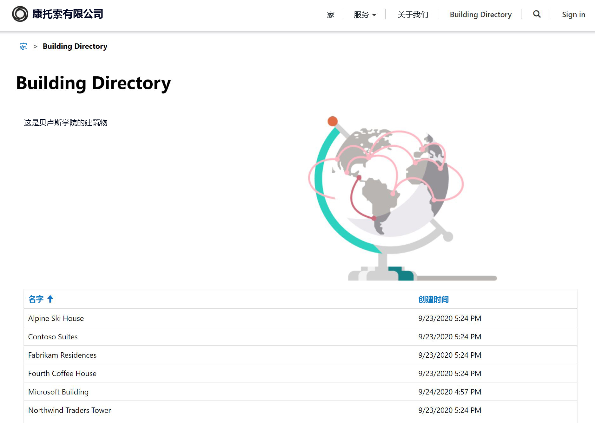

---
lab:
     title: '实验室 5：如何构建 Power Apps 门户'
     module: '模块 3: Power Apps 入门'
---

# 模块 3: Power Apps 入门

## 实验室 4：如何构建 Power Apps 门户

# 应用场景

贝洛斯学院 (Bellows College) 是一所教育机构，校园内有多座建筑。目前，校园访问记录在纸质日报上。无法始终如一地捕获信息，也无法收集和分析有关整个校园的访问数据。

校园管理部门希望向访问者提供有关校园建筑物的信息。访问者将能够在网站上查看建筑物列表，该网站将使用 Power Apps 门户进行构建。

在本实验室中，你将预配 Power Apps 门户并创建一个门户网页，该网页将显示校园中的建筑物列表。

# 高级实验室步骤

将按照以下大纲设计 Power Apps 门户：

* 在 Common Data Service 环境中预配 Power Apps 门户
* 创建并配置网页以显示建筑物列表
* 新建主题并将其应用于门户

## 先决条件

* 完成**模块 0 实验 0 - 验证实验室环境**
* 完成**模块 2 实验 1 - Common Data Service 简介**

## 开始前要考虑的事项

* Power Apps 门户应用总是始于模板，而非空白应用程序。预配门户后，它就已具备页面、菜单和默认主题。

# 练习 \#1：预配 Power Apps 门户

**目标：** 在本练习中，你将在你的环境中预配一个 Power Apps 门户，该门户可在万维网上的任何位置访问。

## 任务 \#1：预配 Power Apps 门户

1.  新建门户应用。

    -   登录至 <https://make.powerapps.com>

    -   如果右上角显示的 **“环境”** 不是你的练习环境，请选择你的“环境”。

    -   单击 **“生成自己的应用”** 下面的 **“从空白门户开始”** 面板

2.  提供新门户详细信息

    -   输入 **“Bellows College 访客”** 作为门户 **“名称”**

    -   提供唯一 URL： **something**.powerappsportals.com（如果该名称已占用，请选择其他名称）

    -   选择一个基本门户 **“语言”**

    -   单击 **“创建”**

3. 门户预配过程可能需要 30 到 45 分钟。  请耐心等待。

任务 \#2：导航到门户
--------------------------------

1.  预配完门户后，你将在 <https://make.powerapps.com> 中收到通知

2.  打开新的门户

    -   单击 **“应用”**

    -   找到 **“类型”** 为 **“门户”** 的应用

    -   单击应用名称

3.  系统会将你重定向到带有欢迎消息的登陆页面的门户网站

练习 \#2：创建门户网页
===============================

**目标：**在本练习中，你将创建一个新的网页，其中将显示一些静态内容以及 Common Data Service 中的建筑物列表。

任务 #1：创建网页
--------------------------------

1.  打开 Power Apps 门户 Studio

    -   登录到 <https://make.powerapps.com>（你可能仍在标签页中打开着此页面）

    -   找到 **“类型”** 为 **“门户”** 的应用

    -   单击省略号 (**...**) 并选择 **“编辑”**

2.  你现在位于 Power Apps 门户 Studio 中。你可以在此处修改和创建门户内容。

3.  创建新页面

    -   在命令栏上，选择 **“新建页面”**

    -   鼠标悬停在 **“固定布局”** 上，然后选择 **“标题页”**

4.  修改页面属性

    -   在属性窗格的 **“显示”** 下，将 **“名称”** 从 **“新建页面 (1)”** 更改为 **“建筑物目录”**，按 Tab 键（启动自动保存）

    -   页面标题现在应显示为 **“建筑物目录”**

    -   在 **“部分 URL”** 中，将值更改为 **“building-directory”**， 按 Tab 键（启动自动保存）

任务 #2：添加静态内容
--------------------------------

1.  向网页添加一节

    -   在画布上（显示网页的区域），选择 **“页面复制”** 节。这是页面中间 2 个文本句子周围的大框。

    -   在工具带（左侧）上，选择 **“组件”** 图标

    -   从 **“节布局”** 区域选择 **“两列节”**

2.  添加静态文本

    -   在画布（显示网页的区域）上选择左列

    -   在工具带（左侧）上，选择 **“组件”** 图标

    -   从 **“门户组件”** 选择 **“文本”**

    -   在新的文本区域中，输入以下文本：
          ```
          以下是建筑物目录。
          ```
    -   选择刚编辑的文本上方的文本框，然后单击命令栏上的 **“删除”** 以删除默认文本。

3. 添加图片

    -   在画布（显示网页的区域）上选择右列

    -   在工具带（左侧）上，选择 **“组件”** 图标

    -   从 **“门户组件”** 区域选择 **“图片”**

    -   在属性窗格中，单击 **“选择图片”**。找到并选择 **“Product A.png”**
    
    -   在属性窗格中，单击“格式设置”部分下拉列表，然后将 **“宽度”** 更改为 70%（请务必输入 %）。你可以尝试调整图片的大小，直到达到所需的大小为止。

4.  单击 **“浏览网站”** 查看到目前为止的页面。  请注意，主菜单上有 **“建筑物目录”** 选项。

任务 #3：添加列表组件
--------------------------------

1.  打开 Power Apps 门户 Studio

    -   登录到 <https://make.powerapps.com>（你可能仍在标签页中打开着此页面）

    -   找到 **“类型”** 为 **“门户”** 的应用

    -   单击省略号 (**...**) 并选择 **“编辑”**
    
2.  编辑你先前创建的现有页面

    -   在工具带（左侧）上，选择 **“页面”** 选项 

    -   找到并选择你先前创建的 **“建筑物目录”** 页面
    
3.  添加列表组件

    -   在工具带（左侧）上，选择 **“组件”** 图标

    -   从 **“节布局”** 区域选择 **“一列节”**（网页上图片和文字下方会出现一个部分）

    -   在画布上选择新的列节

    -   在工具带（左侧）上，选择 **“组件”** 图标

    -   从 **“门户组件”** 区域选择 **“列表”**（列表组件将出现在新节中）
    
4.  配置列表组件

    -   选择画布上的列表组件

    -   在属性窗格（右侧）中，在 **“名称”** 字段中输入 **“建筑物列表”**

    -   在 **“实体”** 字段中，从下拉列表中选择 **“建筑物”**

    -   在 **“视图”** 中，选择 **“可用建筑物”**

    -   保留其余的默认设置
    
5.  单击 **“浏览网站”** 以查看页面。你应该会在网页上看到 Common Data Service 中的建筑物列表。

练习 \#3：更改门户主题
===============================

**目标：** 在本练习中，你将创建一个新主题，该主题将更改门户的配色方案。 

任务 #1：应用和编辑主题
--------------------------------

1.  打开 Power Apps 门户 Studio

    -   登录到 <https://make.powerapps.com>（你可能仍在标签页中打开着此页面）

    -   找到 **“类型”** 为 **“门户”** 的应用

    -   单击省略号 (**...**) 并选择 **“编辑”**
    
2.  应用并自定义基本主题

    -   在工具带（左侧）上，选择 **“组件”** 图标
    
    -   单击 **“启用基本主题”** 的切换按钮以开启此功能。
    
    -   在其中一个预设上，单击省略号 (**...**) 并选择 **“自定义”**。
    
    -   基本主题的副本已创建。 
    
    -   在属性窗格上，尝试更改颜色并探索这些更改对门户的影响。
    
    -   重命名主题。
    
3.  保存你进行的更改

    -   在命令栏上，单击 **“同步配置”**。


你的应用布局应类似于以下结构：



# 挑战

* 创建一个不同的仅显示建筑物名称的建筑物视图。你将需要在门户 Studio 中选择 **“浏览网站”** 以查看更改。
* 在工具带上，单击 **“主题”** 图标，然后编辑自定义主题的 CSS。
* 用 **“表单”** 组件创建一个页面，并修改一个 **“列表”** 组件来添加或编辑带有表单的 Common Data Service 记录。
* 在 **“列表”** 组件 **“设置中”** 中启用 **“实体权限”**，数据有何变化？
* 在门户 Studio 中，选择“源代码编辑器”图标 `</> ` 查看页面源。如果你熟悉 HTML，请进行一些修改并查看结果。
