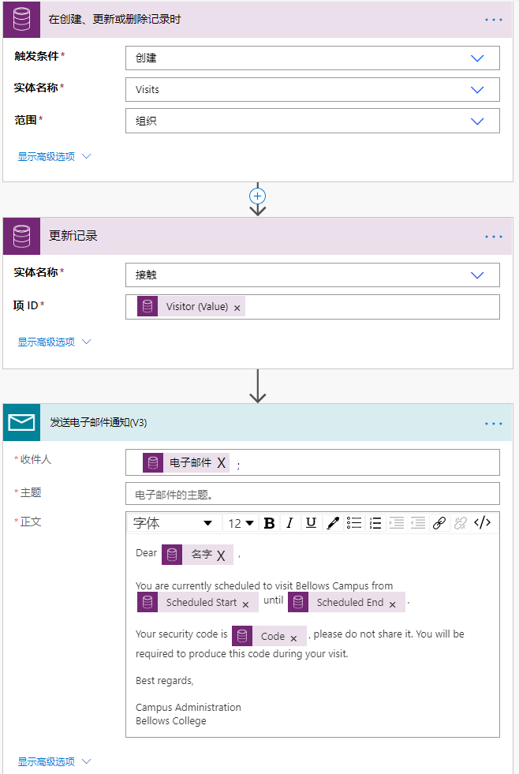

---
lab:
    title: '实验室 6：如何生成自动化解决方案'
    module: '模块 4：Power Automate 入门'
---

# 模块 4：Power Automate 入门
## 实验室：如何生成自动化解决方案

### 重要通知（2020 年 11 月起生效）：
Common Data Service 已更名为 Microsoft Dataverse。Microsoft Dataverse 中的一些术语已更新。例如，“实体”现已更新为“表”。Dataverse 数据库中的“字段”和“记录”现在称为“列”和“行”。

虽然应用程序正在更新其用户体验，但对一些 Microsoft Dataverse 术语（例如“实体”（现在为“表”）、“字段”（现在为“列”）和“记录”（现在为“行”））的引用已过期。请在完成实验室时记住这一点。我们希望很快就能完全更新我们的内容。 

有关详细信息和受影响术语的完整列表，请访问 [Microsoft Dataverse 是什么？](https://docs.microsoft.com/zh-cn/powerapps/maker/common-data-service/data-platform-intro#terminology-updates)

## 应用场景

贝洛斯学院 (Bellows College) 是一所教育机构，校园内有多座建筑。当前，校园访客被记录在纸质日记中。无法始终如一地捕获信息，也无法收集和分析有关整个校园的访问数据。 

校园管理部门希望对其访客登记系统进行现代化改造。在该系统中，由安全人员控制对建筑物的访问，所有访问都必须由主办人预先登记和记录。

在整个课程中，你将生成应用程序并执行自动化，以使 Bellows College 的管理和安全人员可以管理和控制校园建筑的出入情况。 

在本实验室中，你将创建 Power Automate 流以自动化校园管理的各个部分。 

# 概要实验室步骤

以下已被确定为完成项目必须满足的要求：

* 分配给每个访客的唯一代码必须在他们访问之前提供给他们。
* 安全人员需要接收访客超时停留的通知。

## 前提条件

* 完成**模块 0 实验 0 - 验证实验室环境**
* 完成**模块 2 实验 1 - Common Data Service 简介**
* 在 **“模块 3 实验室 2 - 如何生成画布应用，第 2 部分”** 中创建的校园职工应用（用于测试）
* 在 **“模块 3 实验室 4 - 如何生成模型驱动应用”中使用个人电子邮件地址创建的联系人 John Doe** （用于测试）

## 开始前要考虑的事项

-   访客代码的最合适分发机制是什么？
-   如何衡量过久停留并执行严格的策略？

# 练习 \#1：创建访问通知流

**目标：** 在本练习中，你将创建一个实现要求的 Power Automate 流。应向访客发送一封电子邮件，其中包含分配给访问的唯一代码。

## 任务 \#1：创建流

1.  打开校园管理解决方案。

    -   登录至 <https://make.powerapps.com>

    -   选择你的 **“环境”。**

    -   选择 **“解决方案”**。

    -   单击打开 **“校园管理”** 解决方案。

2.  请单击 **“新建”**，然后选择 **“流”**。这将在新窗口中打开 Power Automate 流编辑器。

3. 搜索 *“当前”*，然后选择 **“Common Data Service（当前环境）”** 连接器。

4. 选择触发器 **“创建、更新或删除记录时”**。

   * 为 **“触发条件”** 选择 **“创建”**
   
   * 为 **“实体名称”** 选择 **“访问”**
   
   * 为 **“范围”** 选择 **“组织”**
   
   * 在触发器步骤上，单击省略号 (**...**)，然后单击 **“重命名”**。将此触发器重命名为 **“创建访问时”**。这是一个很好的习惯，这样你和其他流编辑可以理解步骤的目的，而不必深入研究细节。

5.  单击 **“新建步骤”**。必须执行此步骤来检索访客信息，包括电子邮件地址。

6. 搜索 *“当前”*，然后选择 **“Common Data Service（当前环境）”** 连接器。

7. 选择 **“获取记录”** 操作。 

   * 选择 **“联系人”** 作为 **“实体名称”**
   
   * 在 **“项目 ID”** 字段中，选择动态内容列表中的 **“访客（值）”**。
   
   * 在此操作上，单击省略号 (**...**)，然后单击 **“重命名”**。将此操作重命名为 **“获取访客”**。这是一个很好的习惯，这样你和其他流编辑可以理解步骤的目的，而不必深入研究细节。

8. 单击 **“新建步骤”**。这是创建并向访客发送电子邮件的步骤。

9. 搜索 *“邮件”*， 选择 **“邮件”** 连接器和 **“发送电子邮件通知”** 操作 

   * 如果要求接受使用此操作的条款和条件，请单击 **“接受”**。
   
   * 从动态内容列表中选择 **“收件人”** 字段，然后选择 **“电子邮件”**。请注意，它位于 **“获取访客”** 标题下面。这意味着你正在选择与上一步中查找的访客相关的电子邮件。 

   * 在 **“主题”** 字段中输入 **“你对 Bellows College 的计划访问”**。

   * 在 **“电子邮件正文”** 中输入以下文本：  
        
        > 需将动态内容置于方括号中命名字段的位置。建议先复制并粘贴所有文本，然后在正确的位置添加动态内容。
   
        ```
        Dear {First Name},

        You are currently scheduled to visit Bellows Campus from {Scheduled Start} until {Scheduled End}.

        Your security code is {Code}, please do not share it. You will be required to produce this code during your visit.

        Best regards,

        Campus Administration
        Bellows College
        ```
   
10.  选择顶部的 **“无标题”** 流名称，并将其重命名为 `Visit notification`

11. 按下 **“保存”**

    将此流选项卡保持打开状态以用于下一个任务。流大致如下所示：



## 任务 \#2：验证并测试流

1.  在浏览器中打开一个新选项卡，然后导航到 <https://make.powerapps.com>

2.  单击 **“应用”**，然后选择你创建的 **“Campus Staff”** 应用

3.  保持此选项卡处于打开状态，然后导航回到上一个流选项卡。 

4.  在命令栏上，单击 **“测试”**。选择 **“我将执行触发器操作”**，然后选择 **“保存并测试”**。

5.  保持流选项卡处于打开状态，然后使用 **Campus Staff** 应用导航回上一个选项卡。

6.  按 **“+”** 添加新的访问记录

7.  输入 **“John Doe”** 作为 **“姓名”**，并选择任意 **“建筑物”**

8.  选择 **“John Doe”** 作为 **“访客”**

9.  选择 **“计划开始日期”** 和 **“计划结束日期”** 到将来的任何日期。

10.  按下**复选标记**图标以保存新访问

11.  导航回到上一个正在测试的流所在的选项卡。观察流运行情况。如果出现任何错误，请返回并将你的流与以上示例进行比较。如果电子邮件发送成功，你将在收件箱中收到它。 

12.  单击命令栏上的后退箭头

13.  在 **“详细信息”** 部分，请注意，**“状态”** 将设置为 **“开启”**。这意味着你的流将在每次新建访问时运行，直到你将其关闭。只要流运行，它会出现在 **“28 天运行历史记录”** 列表中。

14.  单击命令栏上的 **“关闭”** 关闭流。你可能需要按省略号 (**...**) 才能查看此选项。

15.  关闭该窗口。

# 练习 2：创建安全扫描流

**目标：** 在本练习中，你将创建一个实现要求的 Power Automate 流。每 15 分钟执行一次安全扫描，如果有访客逗留超时，则会通知保安。

## 任务 #1：创建流以检索记录

1. 打开校园管理解决方案。

   -   登录至 <https://make.powerapps.com>

   -   选择你的 **“环境”**。

   -   选择 **“解决方案”**。

   -   单击打开 **“校园管理”** 解决方案。

2. 请单击 **“新建”**，然后选择 **“流”**。这将在新窗口中打开 Power Automate 流编辑器。

3. 搜索 *“定期”*，选择 **“计划”** 连接器，然后选择 **“定期”** 触发器。

4. 将 **“间隔”** 设置为 **“15 分钟”**

5. 单击 **“新建步骤”**。 搜索 *“当前”*，然后选择 **“Common Data Service（当前环境）”** 连接器。选择 **“列出记录”** 操作。

   * 输入 **“访问”** 作为 **“实体名称”**
   
   * 单击 **“显示高级选项”**

   * 输入以下表达式作为 **“过滤器查询”**

   ```
     statecode eq 0 and bc_actualstart ne null and bc_actualend eq null and Microsoft.Dynamics.CRM.OlderThanXMinutes(PropertyName='bc_scheduledend',PropertyValue=15)
   ```
   
   * 要进行细分：
       * **“statecode eq 0”** 筛选活动访问（其中“状态”为“活动”）
       * **“bc_actualstart ne null”** 将搜索限制为“实际开始时间”存在值的访问，即存在签入
       * **“bc_actualend eq null”** 将搜索限制在没有签出的访问（“实际结束时间”没有值） 
       * **“Microsoft.Dynamics.CRM.OlderThanXMinutes (PropertyName='bc_scheduledend',PropertyValue=15)”** 限制访问要在 15 分钟前完成。

   * 在此操作上，单击省略号 (**...**)，然后单击 **“重命名”**。重命名此操作 **“列出结束超过 15 分钟的活动访问”**。这是一个很好的习惯，这样你和其他流编辑可以理解步骤的目的，而不必深入研究细节。

6.  单击 **“新建步骤”**。搜索 *“应用”*， 选择 **“应用到每一个”** 操作 

7.  从 **“从先前的步骤中选择一个输出”** 字段的动态内容中选择 **“值”**。请注意，它位于 **“列出结束超过 15 分钟的活动访问”** 灰色标题下方。这意味着你选择的是在上一步中查找的访问列表。 

8.  检索建筑物数据以获取相关记录

    * 在“应用到每一个”循环内单击 **“添加操作”**。
    
    * 搜索 *“当前”*，然后选择 **“Common Data Service（当前环境）”** 连接器。 
    
    * 选择 **“获取记录”** 操作。
    
    * 选择 **“建筑”**  作为 **“实体名称”**
    
    * 从动态内容中选择 **“建筑物（值）”** 作为 **“项目 ID”**
    
    * 单击 **“获取记录”** 旁边的 **“...”**，选择 **“重命名”**。输入 **“获取建筑物”** 作为步骤名称
    
9.  检索访客数据以获取相关记录

    * 在“应用到每一个”循环内单击 **“添加操作”**。
    
    * 搜索 *“当前”*，然后选择 **“Common Data Service（当前环境）”** 连接器。
    
    * 选择 **“获取记录”** 操作。
    
    * 选择 **“联系人”** 作为 **“实体名称”**
    
    * 从动态内容中选择 **“访客（值）”** 作为 **“项目 ID”**
    
    * 单击 **“获取记录”** 旁边的 **“...”**，选择 **“重命名”**。输入 **“获取访客”** 作为步骤名称
    
11.  发送电子邮件通知

     * 在“应用到每一个”循环内单击 **“添加操作”**。从 **“邮件”** 连接添加 **“发送电子邮件通知”** 操作。

12.  在 **“收件人”** 部分输入你的电子邮件地址

13.  在 **“主题”** 字段中输入以下内容。**“全名”** 是来自 **“获取访客”** 步骤的动态内容。

   ```
   {Full Name} overstayed their welcome
   ```
   
14.  在 **“正文”** 字段中输入以下内容。 **“名称”** 是来自 **“获取建筑物”** 步骤的动态内容。

   ```
   There is an overstay in building {Name}
         
   Best,
         
   Campus Security
   ```

17.  选择左上角的流名称 **“无标题”**，并将其重命名为 **“安全扫描”**

18.  按下 **“保存”**

    流看起来应大致如下：


## 任务 #2：验证并测试流

如果访问符合你的流中列出的要求，该流将开始向你发送电子邮件（发送到你先前创建 John Doe 联系人时指定的电子邮件）。

1. 验证你是否具有以下访问记录：

   1. 具有活动状态
   
   2. 预定结束时间是过去的时间（超过 15 分钟）
   
   3. “实际开始时间”有一个值。
   
   > **注意**：要查看此数据，请在新选项卡中导航到 make.powerapps.com。单击左窗格上的“解决方案”，找到你的解决方案。选择“访问”实体，然后选择“数据”选项卡。单击右上角的“有效访问”以显示视图选择器，然后选择“全部”字段。
   
2. 导航到你的解决方案，找到 **“安全扫描”** 流。单击 **“...”**，然后单击 **“编辑”**。

3. 当流打开时，单击 **“测试”**。

4. 选择 **“我将执行触发器操作”**。

5. 单击 **“测试”** 和 **“运行流”**。

6. 当流完成时，请单击 **“完成”**。 

7. 展开 **“应用到每一个”**，然后展开 **“发送电子邮件通知”** 步骤。检查 **“主题”** 和 **“电子邮件正文”** 的值。

8. 导航到解决方案，单击流旁边的 **“...”**，选择 **“关闭”**。这是为了防止流按计划在测试系统上执行。

# 挑战

* 将“实际开始”和“计划结束”添加到电子邮件正文。
* 如何确保电子邮件正文中使用了用户友好的日期格式？
* 是否可以生成一个包含逾期信息的表格，并且只发送一封电子邮件？
* 你可以为访问代码生成条形码吗？什么时候有用？
