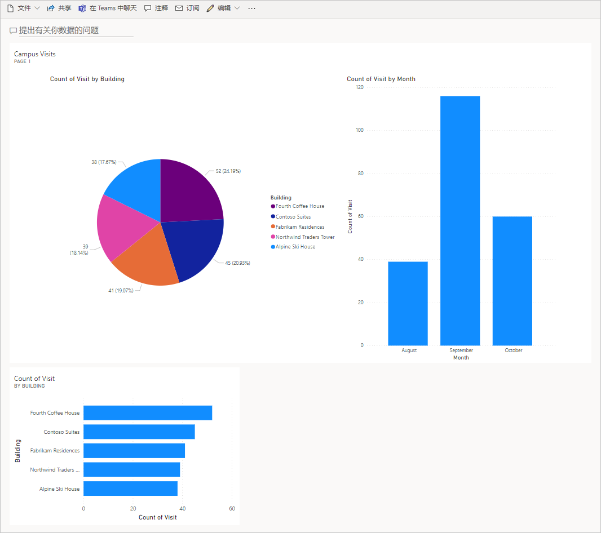

---
lab:
    title: '实验室 7：如何生成简单仪表板'
    module: '模块 5：Power BI 入门'
---

# 模块 5：Power BI 入门
## 实验室：如何生成简单仪表板

# 应用场景

Bellows College 是一所教育机构，校园内有多座建筑。当前，校园访客被记录在纸质日记中。无法始终如一地捕获信息，也无法收集和分析有关整个校园的访问数据。 

校园管理部门希望对其访客登记系统进行现代化改造。在该系统中，由安全人员控制对建筑物的访问，所有访问都必须由主办人预先登记和记录。

在整个课程中，你将生成应用程序并执行自动化，以使 Bellows College 的管理和安全人员可以管理和控制校园建筑的出入情况。 

在本实验室中，你将构建一个 Power BI 仪表板，以可视化方式显示有关校园访问的数据。

# 概要实验室步骤

我们将按照以下步骤设计和创建 Power BI 仪表板：

-   连接到 Dataverse
-   转换数据以包括对相关行（查找）的用户友好描述
-   创建并发布包含各种校园访问信息可视化效果的报表
-   利用用户自然语言查询来生成额外的可视化效果
-   生成 Power BI 仪表板的移动视图


## 前提条件

* 完成 **“模块 0 实验室 0 - 验证实验室环境”**
* 完成 **“模块 2 实验室 1 - Microsoft Dataverse 简介”**

## 开始前要考虑的事项

-   报告的目标受众是谁？
-   受众将如何使用报告？典型的设备？位置？
-   你是否有足够的数据进行可视化？
-   可以使用哪些可能的特征来分析访问数据？

# 练习 \#1：创建 Power BI 报告 

**目标：** 在本练习中，你将基于 Dataverse 数据库中的数据创建 Power BI 报表。

## 任务 \#1：安装 Power BI Desktop/准备 Power BI 服务

1. 请按照以下说明设置 Power BI： 

    - 如果 **Power BI Desktop** 已安装，请跳至[任务 \#2](#task-2-prepare-data)。
    
    - 如果尚未安装 Power BI Desktop，请完成**步骤 #2**。
    
    - 如果你没有必需的权限或在运行 Power BI Desktop 时遇到问题，请继续 **步骤 #4**。

2. 导航到 [https://aka.ms/pbidesktopstore](https://aka.ms/pbidesktopstore) 下载并安装 Power BI Desktop。

    > [!重要事项]
    > 如果在使用 Microsoft Store 安装 Power BI Desktop 时遇到问题，请尝试从 [https://aka.ms/pbiSingleInstaller](https://aka.ms/pbiSingleInstaller) 下载的独立安装程序。

3. 如果成功安装了 Power BI Desktop，现在可以跳至[任务 \#2](#task-2-prepare-data)；否则，请继续下一步。

    > 如果你没有安装桌面应用程序所需的权限，或者在运行或配置 Power BI Desktop 时遇到困难，请完成以下任务步骤。

4. 在计算机上下载并保存 [visits.pbix](../../Allfiles/visits.pbix)。

5. 导航到 [https://app.powerbi.com/](https://app.powerbi.com/) 并单击 **“登录”**。 

6. 单击 **“我的工作区”**。 

7. 如果显示 **“获取数据”** 页面，请单击 **“跳过”**。 

8. 展开 **“+新建”** 并选择 **“上传文件”**。

    > [!重要事项]
    > 如果看不到 **“+ 新建”**，你可能需要激活 Power BI 的新外观。确保将屏幕顶部的 **“新外观”** 切换至 **“开”**。

9. 选择 **“本地文件”**。

10. 找到并选择你之前下载的 **visits.pbix** 文件。

11. 数据加载完成后，选择 **“visits”** 报表（请注意，“类型”设置为 **“报表”**。

12. 单击 **“编辑”**。如果 **“编辑”** 菜单项不可见，请单击 **“...”**，然后选择 **“编辑”**。

13. 现在，你已经设置了 Power BI 服务以用于你的实验室。继续[任务 \#3](#task-3-create-chart-and-time-visualizations)，但可以在整个实验室中使用联机 Power BI 服务 ([https://app.powerbi.com](https://app.powerbi.com))，而不是 Power BI Desktop。

## 任务 \#2：准备数据

1.  找到贵组织 URL

    * 在新选项卡中，导航到 Power Platform 管理中心，网址为 <https://admin.powerplatform.com>
    
    * 在左侧导航页中，选择“环境”，然后打开“练习”环境。
    
    * 右键单击在 **“详细信息”** 面板上的 **“环境 URL”**，然后选择 **“复制链接地址”**。
    
2. 打开 Power BI Desktop，如果出现提示，请使用提供给你的凭据登录。

3. 选择 **“获取数据”**。

4. 选择左侧的 **“Power Platform”**，然后选择 **“Common Data Service”**，最后按 **“连接”**。

5. 将你先前复制的环境 URL 粘贴到 **“服务器 URL”** 字段，按 **“确定”**。

6. 展开 **“实体”** 节点，选择 **“bc_Building”** 和 **“bc_Visit”** 实体，然后单击 **“加载”**。

7. 单击左侧垂直工具栏上的 **“模型”** 图标。

8. 拖动 **bc_Building** 表中的 **bc_buildingid** 列并将其放置到 **bc_Visit** 表中的 **bc_building** 列中 。这将在两个表之间创建关系，Power BI 将使用这两个表来显示相关数据。

9. 选择左侧工具栏上的 **“报表”** 图标。

10. 展开 **“字段”** 面板中的 **bc_Visit** 节点。

11. 单击 **bc_Visit** 旁边的 **“...”**，然后选择 **“新建列”**。

12. 按如下方式完成公式：

    ```
    Column = RELATED(bc_Building[bc_name])
    ```

    然后按 Enter。这会将带有建筑名称的新字段添加到访问数据中。

13. 单击你刚刚创建的 **“列”** 字段旁边的 **“...”**，并选择 **“重命名”**。输入 **“建筑”** 作为字段名称。

14. 单击 **bc_visitid** 字段旁边的 **“...”**，并选择 **“重命名”**。输入 **“访问”** 作为字段名称。

15. 单击 **bc_scheduledstart** 字段旁边的 **“...”**，并选择 **“重命名”**。输入 **“开始”** 作为字段名称。

16. 要保存正在进行的工作，请按下 **“文件 \| “保存”** 并输入你选择的文件名。

## 任务 #3：创建图表和时间可视化

1. 按 **“可视化效果”** 面板中的饼图图标，以插入图表。

2. 拖动 **“建筑”** 字段并将其放入 **“图例”** 框。

3. 拖动 **“访问”** 字段并将其放入 **“值”** 目标框。

4. 使用角柄调整饼图的大小，以便所有图表组件均可见。

5. 单击饼图外的报表以取消选择它，然后选择 **“可视化效果”** 窗格中的堆积柱形图。 

6. 拖动 **“访问”** 字段并将其放入 **“值”** 目标框。

7. 拖动 **“开始”** 字段并将其放入 **“轴”** 目标框。

8. 在“可视化效果”窗格中，单击 **“天”** 和 **“季度”** 旁边的 **“x”**，只为 **“轴”** 留下 **“年”** 和 **“月”** 总计。

9. 根据需要使用角柄调整图表大小。

10. 测试报告交互性：

    * 在饼图上选择各种建筑切片，并观察时间报告上的变化。
    
    * 单击柱形图。按向下箭头开启 **“向下钻取”** 模式，然后按该列以向下钻取到下一个级别（月）。另一种方法是单击功能区上的 **“数据/钻取 \| 展开下一级别”**。
    
    * 向上和向下钻取，选择时间柱形图上的各种条形，以观察饼图报告中的变化。
    
11. 要保存正在进行的工作，请按下 **“文件 \| “保存”**。

# 练习 2：创建 Power BI 仪表板

## 任务 #1：发布 Power BI 报告

1. 按功能区“主页”选项卡上的 **“发布”** 按钮。

2. 选择 **“我的工作区”** 作为目的地，然后按 **“选择”**。

3. 等待发布完成，然后单击 **“在 Power BI 中打开 \<name of your report\>.pbix”**。

## 任务 #2：创建 Power BI 仪表板

1. 打开上一个任务中生成的报表。

2. 在菜单上选择 **“固定到仪表板”**。根据布局，你可能需要按 **“...”** 以显示其他菜单项。

3. 在 **“固定到仪表板”** 提示上选择 **“新建仪表板”**。

4. 输入 **“[你的姓氏] 校园管理”** 作为 **“仪表板名称”**，然后按 **“固定活动页”**。

5. 依次选择顶部的 **“我的工作区”**、 **“[你的姓氏] 校园管理”** 仪表板。

6. 测试显示的饼图和条形图的交互性。

## 任务 #3：使用自然语言添加可视化

1. 在 **“校园管理”** 仪表板内，选择顶部的 **“提出与数据有关的问题”** 栏。

2. 输入问答区域中 **“按访问次数划分的建筑”**。将显示条形图。

3. 选择 **“固定视觉对象”**。

4. 依次选择 **“现有仪表板”**、 **“[你的姓氏] 校园管理”** 仪表板，然后按 **“固定”**。

5. 单击 **“退出问答”**。

将显示 **“[你的姓氏] 校园管理”** 仪表板。可能需要向下滚动才能看到新的“问答”视觉对象。 

你的仪表板应类似如下所示：



## 任务 #4：生成手机视图并通过 QR 码共享报表

1. 在仪表板中，选择 **“编辑 \| 移动视图”**。

2. 根据需要重新排列图块。

3. 单击右上角的 **“手机视图”**，并将“视图”更改为 **“Web 视图”**。

4. 选择顶部的 **“我的工作区”**，然后选择 **“报表”**。

5. 选择 **“编辑”**，然后选择 **“...\| 生成 QR 码”**。

6. *可选：* 如果你拥有移动设备，请使用 iOS 和 Android 平台上均可用的 QR 扫描仪应用来扫描 QR 码，如果手机支持，也可使用相机应用扫描 QR 码。如果出现提示，请登录帐户。在移动设备上导航和浏览报表。

# 挑战

* 仪表板和报表，包括校园和建筑平面图
* 报告并分析访问模式和趋势
* 逾期可视化
* 流式 Power BI，用于大型校园的近实时处理 
